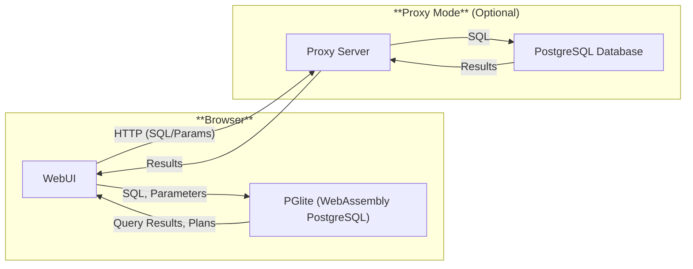

SQL is a declarative language; only the result of the query is specified. The exact steps to produce the result must be determined by the DBMS. Often, multiple ways exist to calculate a query result. For example, the DBMS can choose to use an index or perform a sequential scan on a table to find the needed tuples.

The query optimizer is responsible for finding the most efficient plan for a given query. The plan generator creates possible plans, which are then evaluated based on their costs. Afterward, the cheapest plan is chosen and executed. When the DBMS expects to return a large portion of the table, a full table scan can be more efficient than following the pointers in an index structure. However, it is hard to determine when the DBMS prefers one plan over another and when the switch between plans occurs.

In a few evenings, [I implemented the plan explorer](https://jnidzwetzki.github.io/2025/05/18/building-a-query-plan-explorer.html) for PostgreSQL. It iterates over a search space and generates visualizations that show when the plan changes and how many tuples are expected versus the actual number returned. This blog post examines the "art" of query optimization. It discusses the plan explorer tool, the images the tool generates, and the insights the tool provides into the decisions made by the PostgreSQL query optimizer.

<!--more-->

# Plan Explorer
Plan Explorer is a tool that iterates over a two-dimensional search space and executes a given SQL query for each parameter combination. Based on the returned query plans (and actual query executions), various diagrams are generated. These diagrams have an artistic aspect, but they also provide valuable insights into the workings of the query optimizer and visually represent the decisions made (i.e., at which point PostgreSQL considers using a specific index).

The tool is based on the ideas of [Picasso](https://dl.acm.org/doi/10.14778/1920841.1921027), but implemented as a modern web application.

> The Picasso database query optimizer visualizer, Jayant R. Haritsa, Proceedings of the VLDB Endowment, Volume 3, Issue 1-2, September 2010

## Server Mode
Initially, the tool was developed as a standalone website that does not require any server component. The WebAssembly build of PostgreSQL, [PGlite](https://pglite.dev/), is used to run PostgreSQL within the user's browser and extract the needed query plans.

In the most recent version of the tool, an optional server mode was added. Using this server mode, queries are sent to a _REST_ endpoint on a web server. On the web server, a script can take the requested queries and forward them to an actual PostgreSQL server. The server component acts as a proxy for query execution. This is necessary because, due to security constraints, JavaScript running in a browser cannot open network connections to other hosts. So, to communicate with a real PostgreSQL server, the proxy component is needed. However, when an actual PostgreSQL server is queried, large datasets can be preloaded or custom extensions can be integrated into the database server. This allows the tool to run in these environments as well (e.g., a PostgreSQL extension developer could check their custom cost models and whether PostgreSQL picks up the desired query plans).

The architecture of the plan explorer is shown in the diagram below:



A further feature of the server mode is that the queries can also be executed (`EXPLAIN (ANALYZE)`) instead of only being planned (`EXPLAIN`). When only the planning of the query is performed, the tool operates much faster and can quickly iterate over the given search space. On the other hand, if the query is actually executed, PostgreSQL provides further information, such as the actual number of returned tuples or the execution time.

## Generated Drawings
The plan explorer tool creates several different drawings from one query. These drawings are:

* The used query plans
* The expected costs of the query
* The actual execution time of the query
* The estimated number of result tuples
* The actual number of result tuples
* The difference between the estimated and actual number of result tuples 

For a database administrator, the different query plans and their distribution might be the most interesting output of the tool. For a developer who has implemented custom scan nodes and cost models, the other outputs may also be of interest. They enable database developers to determine if the cost models function as expected. 

# Example Query Discussion

In this section, the output of the tool for the following query is discussed. The query performs a self-join of the table `data` on the attribute `key`. Two predicates in the `WHERE` clause define filter conditions. The exact values for these conditions are determined by the search space. In this example, the search space for both dimensions is the interval `[0; 50000]` and steps of 1000 are used. 

```sql
SELECT * FROM data d1 LEFT JOIN data d2 ON (d1.key = d2.key) WHERE d1.key > %%DIMENSION0%% AND d2.key > %%DIMENSION1%%;
```

The query is executed after the database is prepared with the following SQL commands:

```sql
CREATE TABLE data(key integer, value text);
INSERT INTO data (key, value) SELECT i, i::text FROM generate_series(1, 100000) i;
CREATE INDEX ON data(key);
ANALYZE data;
```

So, the table `data` consists of 100000 tuples and has an index on the attribute `key`. 

The query plan explorer reveals that five different query plans are used by PostgreSQL for the given parameter combinations of the search space. 

## Query Plans



In the following two subsections, two of the five different query plans are discussed. Query plan 1 is the light blue one in the middle left side of the drawing. Query plan 2 is the area in the upper left corner of the drawing. 

### Query Plan 1
The first query plan has the following fingerprint. Fingerprints are used by the query plan explorer to classify query plans as identical (e.g., the parameters in some nodes can change but the structure of the query plan is the same): ```Hash Join > Seq Scan(d1) > Hash > Seq Scan(d2)```

So, the query plan consists of a hash join. One child node of the hash join is a sequential scan and the other child is a hash operator which also reads the tuples of the `data` table. No index scans are used.

__Note:__ One interesting optimization in PostgreSQL is that the executed join type is changed. In the query, a `LEFT JOIN` is performed. However, an `INNER JOIN` (`"Join Type": "Inner",`) is actually executed. A left join guarantees that every tuple of the left input relation is contained in the output. If no join partner is found, the tuple is added to the output and all attributes of the right relation are populated with `NULL` values. However, since a filter is applied on the key attribute of the right relation (`d2.key > %%DIMENSION1%%`), none of these artificially generated tuples would fulfill the filter condition (a tuple with a NULL attribute for key will always be eliminated by the filter). So, there is no need to generate these tuples that are removed later. Therefore, PostgreSQL changes the join type to an inner join and does not generate these tuples at all.

```json
[
  {
    "Plan": {
      "Node Type": "Hash Join",
      "Parallel Aware": false,
      "Async Capable": false,
      "Join Type": "Inner",
      "Startup Cost": 3040,
      "Total Cost": 6205,
      "Plan Rows": 100000,
      "Plan Width": 18,
      "Actual Startup Time": 20.053,
      "Actual Total Time": 55.887,
      "Actual Rows": 100000,
      "Actual Loops": 1,
      "Inner Unique": false,
      "Hash Cond": "(d1.key = d2.key)",
      "Plans": [
        {
          "Node Type": "Seq Scan",
          "Parent Relationship": "Outer",
          "Parallel Aware": false,
          "Async Capable": false,
          "Relation Name": "data",
          "Alias": "d1",
          "Startup Cost": 0,
          "Total Cost": 1790,
          "Plan Rows": 100000,
          "Plan Width": 9,
          "Actual Startup Time": 0.006,
          "Actual Total Time": 10.072,
          "Actual Rows": 100000,
          "Actual Loops": 1,
          "Filter": "(key > 0)",
          "Rows Removed by Filter": 0
        },
        {
          "Node Type": "Hash",
          "Parent Relationship": "Inner",
          "Parallel Aware": false,
          "Async Capable": false,
          "Startup Cost": 1790,
          "Total Cost": 1790,
          "Plan Rows": 100000,
          "Plan Width": 9,
          "Actual Startup Time": 20.036,
          "Actual Total Time": 20.036,
          "Actual Rows": 100000,
          "Actual Loops": 1,
          "Hash Buckets": 131072,
          "Original Hash Buckets": 131072,
          "Hash Batches": 1,
          "Original Hash Batches": 1,
          "Peak Memory Usage": 5115,
          "Plans": [
            {
              "Node Type": "Seq Scan",
              "Parent Relationship": "Outer",
              "Parallel Aware": false,
              "Async Capable": false,
              "Relation Name": "data",
              "Alias": "d2",
              "Startup Cost": 0,
              "Total Cost": 1790,
              "Plan Rows": 100000,
              "Plan Width": 9,
              "Actual Startup Time": 0.003,
              "Actual Total Time": 9.906,
              "Actual Rows": 100000,
              "Actual Loops": 1,
              "Filter": "(key > 0)",
              "Rows Removed by Filter": 0
            }
          ]
        }
      ]
    },
    "Planning Time": 0.504,
    "Triggers": [],
    "Execution Time": 58.059
  }
]
````

### Query Plan 2
The second query plan ```Hash Join > Seq Scan(d1) > Hash > Index Scan(d2)``` has a similar structure as the first one but with one exception: an index scan is used for the input of the hash operation (`"Node Type": "Index Scan"`).

```json
[
  {
    "Plan": {
      "Node Type": "Hash Join",
      "Parallel Aware": false,
      "Async Capable": false,
      "Join Type": "Inner",
      "Startup Cost": 2530.96,
      "Total Cost": 5297.79,
      "Plan Rows": 60183,
      "Plan Width": 18,
      "Actual Startup Time": 26.732,
      "Actual Total Time": 48.043,
      "Actual Rows": 60000,
      "Actual Loops": 1,
      "Inner Unique": false,
      "Hash Cond": "(d1.key = d2.key)",
      "Plans": [
        {
          "Node Type": "Seq Scan",
          "Parent Relationship": "Outer",
          "Parallel Aware": false,
          "Async Capable": false,
          "Relation Name": "data",
          "Alias": "d1",
          "Startup Cost": 0,
          "Total Cost": 1790,
          "Plan Rows": 100000,
          "Plan Width": 9,
          "Actual Startup Time": 0.004,
          "Actual Total Time": 9.898,
          "Actual Rows": 100000,
          "Actual Loops": 1,
          "Filter": "(key > 0)",
          "Rows Removed by Filter": 0
        },
        {
          "Node Type": "Hash",
          "Parent Relationship": "Inner",
          "Parallel Aware": false,
          "Async Capable": false,
          "Startup Cost": 1778.67,
          "Total Cost": 1778.67,
          "Plan Rows": 60183,
          "Plan Width": 9,
          "Actual Startup Time": 18.759,
          "Actual Total Time": 18.76,
          "Actual Rows": 60000,
          "Actual Loops": 1,
          "Hash Buckets": 65536,
          "Original Hash Buckets": 65536,
          "Hash Batches": 1,
          "Original Hash Batches": 1,
          "Peak Memory Usage": 2973,
          "Plans": [
            {
              "Node Type": "Index Scan",
              "Parent Relationship": "Outer",
              "Parallel Aware": false,
              "Async Capable": false,
              "Scan Direction": "Forward",
              "Index Name": "data_key_idx",
              "Relation Name": "data",
              "Alias": "d2",
              "Startup Cost": 0.29,
              "Total Cost": 1778.67,
              "Plan Rows": 60183,
              "Plan Width": 9,
              "Actual Startup Time": 0.05,
              "Actual Total Time": 11.329,
              "Actual Rows": 60000,
              "Actual Loops": 1,
              "Index Cond": "(key > 40000)",
              "Rows Removed by Index Recheck": 0
            }
          ]
        }
      ]
    },
    "Planning Time": 0.131,
    "Triggers": [],
    "Execution Time": 49.318
  }
]
```

## Expected Total Cost and Actual Time
Also, drawings for the expected total cost and the actual time are shown. The first image shows that PostgreSQL assumes the highest costs in the lower left corner. This is the moment when both predicates of the `WHERE` condition let all tuples (`> 0`) pass. The costs decrease when one of the predicates can filter more tuples, and PostgreSQL needs to join fewer tuples. The lowest costs are in the upper right corner of the image. The lines have some irregularities since the query plan changes for the parameter combinations, which also affects the total costs of the query.



Closely related to the last image is the total execution time. It shows how long the DBMS actually needs to execute the query. The image also shows the trend that the query becomes faster when fewer tuples have to be processed. However, the times are a bit more scattered. This has two reasons: (i) in the current version of the tool, just a single execution of the query is performed and outliers are not handled (e.g., by taking the average value over multiple executions), and (ii) the query is short and changing the parameters have not a big impact on the actual execution time.



## Expected and Actual Tuples
The following next three images show the expected, actual returned tuples and the difference between these two values. It can be seen by comparing the first two images that the pattern of the expected and the actual returned tuples is different and PostgreSQL actually performed a misprediction. The first drawing shows diagonal lines and the actual graph shows horizontal lines (i.e., changing one of the parameters leads to more tuples in the output independently from the other parameter) and PostgreSQL expects some correlation (so-called _cross-column dependencies_) between these parameters. See the function `clauselist_selectivity()` and its [comment](https://github.com/postgres/postgres/blob/58fbfde152b28ca119fef4168550a1a4fef61560/src/backend/optimizer/path/clausesel.c#L57-L98
) for more details. Using [extended statistics](https://www.postgresql.org/docs/17/planner-stats.html) might help to get a better prediction (this might be covered in a follow-up blog posts).





The last drawing shows the difference between these two graphs. Even if a DBMS user is not usually pleased that the number of result tuples has been incorrectly estimated (as this may result in non-optimal plans being used), this error rewards us with a nice-looking picture.



# Conclusion
This blog post covers the basic functionality of [plan explorer](https://jnidzwetzki.github.io/planexplorer/). The tool is now available as open source at [GitHub](https://github.com/jnidzwetzki/planexplorer). The tool iterates over a two-dimensional search space and executes a query for every parameter combination. Based on the information returned from the database system, the tool draws visualizations of query plans, estimated values like time and returned tuples, and actual values such as the number of returned tuples.

Apart from the artistic aspect of the drawings, the tool gives you insights into the query optimizer decisions of PostgreSQL and highlights mispredictions, such as an incorrect number of returned tuples. So, the tool can be used by anyone who wants to tune cost models or integrate their own cost models into PostgreSQL. The new server mode allows you to connect to real PostgreSQL installations running on another system. Therefore, queries on large (custom) data sets can be analyzed, as well as custom PostgreSQL extensions that are not yet available as a WebAssembly build and integrated into PGlite.